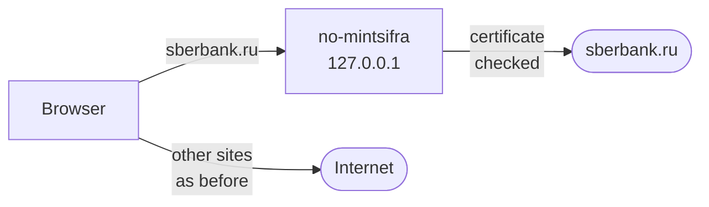

<div align="center">

# 🔐 no-mintsifra

**Open sites that use the Russian Ministry of Digital Development's certificates in any browser: Sberbank, VTB, T-Bank, Alfa-Bank, government services and more.**  
**The Ministry's root certificate is never installed in Windows or in browsers, and no-mintsifra helps remove it if it is already there.**

[](https://github.com/Nettrove/no-mintsifra/releases/latest)
[](#-support)
[](LICENSE)

[Русская версия](README.md)

</div>

> [!CAUTION]
>
> ### Official source
> Install no-mintsifra only from this repository's [releases page](https://github.com/Nettrove/no-mintsifra/releases). The program is free; the project has no channels, groups or paid editions.  
> Copies distributed under the no-mintsifra name anywhere else should be treated as **fake**.

> [!IMPORTANT]
> **What appears on the system once switched on:**
> - the **"no-mintsifra local CA"** certificate. It is created on your computer, is valid only there and only for the listed domains, that is, sites on Ministry certificates;
> - a local proxy on `127.0.0.1` that **only** those domains pass through. Everything else goes the way it did before: direct or through your VPN;
> - autostart, so the bypass keeps working after a reboot.
>
> One menu item removes all of it. **The Ministry's root certificate is not installed.**

> [!WARNING]
>
> ### Antivirus software
> A local proxy with its own certificate works the same way as the HTTPS scanning built into antivirus products, so heuristic engines may react to it.  
> The program is not malicious: the source is open, releases are built in [GitHub Actions](.github/workflows/release.yml), and every release publishes checksums.

## ⚙️ Installation

1. Download `no-mintsifra-...-windows-amd64.zip` from the [latest release](https://github.com/Nettrove/no-mintsifra/releases/latest).

2. Unpack it anywhere.

3. Run **`no-mintsifra.exe`**. A menu opens:
   - **`1` Switch on**. Done once, survives reboots.  
     <ins>Windows asks whether to trust "no-mintsifra local CA". Answer **Yes**.</ins>
   - **`2` Switch off and remove**. Removes the certificate, the proxy, autostart and the program folder.
   - **`3` Check**. Opens every covered name and shows the result.
   - **`4` Update the site list**.
   - **`5` Remove the Ministry certificate**. Finds Ministry certificates installed earlier (for example, following a bank's instructions) and deletes them, including from the machine-wide store.

4. Use your browser as usual. If it was open while switching on, restart it once.

Once switched on, no-mintsifra is in the Start menu and can also be removed from Settings > Apps.

<details>
<summary><b>One-line install with PowerShell</b></summary>

```powershell
irm https://raw.githubusercontent.com/Nettrove/no-mintsifra/main/install.ps1 | iex
```

The script downloads the latest release, checks its hash and signature, and switches the bypass on.

</details>

## 🌐 Support

Sberbank, VTB, T-Bank, Alfa-Bank, NSPK (Mir, SBP), Sovcombank, PSB, Rosselkhozbank, MKB, Rosbank, Uralsib, Tochka, RNCB, Modulbank, MTS Bank, DOM.RF Bank, Expobank, UBRR, Avangard, Bank Saint Petersburg, TKB, SOGAZ, VSK, AlfaStrakhovanie, SPB Exchange, Rosneft, Surgutneftegas, Rosstat and the Federal Treasury. `no-mintsifra sites` prints the full list.

A bot refreshes the list daily from the [catalog](catalog/sites.yaml). Sites that move to ordinary certificates drop out by themselves.

Any browser that uses the Windows proxy settings and certificate store works: Chrome, Edge, Brave, Yandex Browser, Opera, Vivaldi, and Firefox by default (checked on 157). No special shortcuts, flags or profiles.

## ℹ️ How it works



1. **A Windows proxy script** sends only the listed domains to no-mintsifra. Everything else goes as it did before: direct or through a VPN client's proxy.
2. **no-mintsifra connects to the site itself** and checks its certificate: the chain must lead to the Ministry root embedded in the program, and the certificate must be issued for that very site. The root is used **only in the program's memory** and **only for the listed domains**.
3. **The browser gets a certificate from the local CA.** The domain limits are written into the CA certificate itself, so even a stolen key cannot vouch for a site outside the list.
4. After that the bytes **pass unchanged**: nothing is parsed, stored or sent anywhere. The program reaches the site with your browser's own TLS fingerprint, so bot filters do not block it. Plain HTTP to these domains is redirected to HTTPS.

| | Ministry certificate installed | no-mintsifra |
|---|:---:|:---:|
| Trust in the Ministry | **for any site** | only for sites that use its certificates |
| Google, Apple, Microsoft or messengers can be spoofed | yes | **no** |
| Scope | every browser and program | listed domains only |
| Removal | by hand | menu item `2` |

## 🎯 What exactly the Ministry gets

The Ministry root is embedded in the program and lives only in its memory, where it checks the listed sites and nothing else. The names the local CA covers follow strict rules:

- **a whole domain** (such as `sberbank.ru` with all subdomains) is covered only when the Ministry certificate sits on the domain itself or on `www`;
- **otherwise single hosts only**, where the bot saw a Ministry certificate (for example `rosstat.gov.ru`, not all of `gov.ru`);
- **shared domains** (`gov.ru`, `mail.ru`, `yandex.ru`, `vk.com`, `ok.ru`, hosting providers and others) are never covered whole, only host by host;
- **mail, messengers, app stores and similar services** (Google, Apple, Microsoft, Telegram, WhatsApp, Signal, Proton, GitHub and others) are never covered, whatever the list says. This is built into the program and holds even if the key that signs the list is stolen.

When the list changes, menu item **`1`** issues a new certificate and first shows which domains are added and which are dropped. The scope cannot grow without your consent.

## 🚧 What is not covered

- **Programs outside the browser** with their own certificate store (Java, Python, Node.js, many bank clients) or without system proxy support.
- **Browsers with their own certificate store** that ignore Windows certificates, such as Tor Browser or Firefox with `security.enterprise_roots.enabled` switched off (it is on by default).
- **Other systems:** Android, iOS, macOS and Linux are not supported.
- **Sites not on the list.** [Report them](#-adding-a-site).

## 🤔 Why a proxy and not a cross-certificate

A proxy could be avoided by cross-signing the Ministry root's key with a name-constrained certificate, so the browser trusts the Ministry chain directly but only for the listed domains. That has three weak spots:

- **Browsers can block the key itself.** In 2019 Chrome, Firefox and Safari blocklisted the root that Kazakhstan required citizens to install for interception. Such a block goes by key, whoever signed it, so a cross-certificate would stop working the same day. Behind the proxy the browser sees only your local CA and the program checks the Ministry chain itself, so such a block does not affect it.
- **All checking is left to the browser.** In proxy mode the program itself checks the name, the chain and the key against the list and logs mismatches. With a cross-certificate only the constraints inside it remain, and verifiers differ in how they enforce them.
- **It is the Ministry certificate on the computer.** A cross-certificate carries the Ministry's name and key and sits in the Windows store, constraints or not. no-mintsifra does not do that.

That is why no-mintsifra works through the proxy only.

## 🛡 Security

- **Traffic to the listed sites passes through the proxy decrypted.** That is inherent to the design. The proxy runs only on your computer and stores or sends nothing. The code is open: [`internal/proxy`](internal/proxy).
- **The local CA key** is kept in `%LocalAppData%\no-mintsifra\ca`, sealed with DPAPI to your Windows account, and valid only for the listed domains.
- **The site list is signed** with ed25519. An unsigned or older list is refused.
- **The bot checks site certificates** against the Ministry root and the site name.
- **A substituted certificate is noticed.** When a site presents a certificate whose key is not in the signed list, the proxy lets it through but logs a warning that the check (item **`3`**) shows.
- **The proxy log** (`%LocalAppData%\no-mintsifra\proxy.log`) holds only the time, host and reason of failed connections, never traffic.

More: [threat model](docs/THREAT_MODEL.md) and [architecture](docs/ARCHITECTURE.md) (both in Russian). Report vulnerabilities as described in [SECURITY.md](SECURITY.md).

## ☑️ FAQ

<details>
<summary><b>A site does not open</b></summary>

Run no-mintsifra from the Start menu and pick **`3`**; the status should read **ON**. If parts are missing they are named, and item **`1`** repairs the installation. Restart the browser. If that does not help, save a report with `no-mintsifra doctor --report` and attach it to a [bug report](https://github.com/Nettrove/no-mintsifra/issues/new?template=bug.yml).
</details>

<details>
<summary><b>The Ministry certificate is already installed</b></summary>

Pick item **`5`**. It finds the Ministry certificates in your account's and the machine's stores and deletes them; Windows asks for administrator rights for the machine store. Programs outside the browser (1C, bank clients, corporate software) may stop connecting to these sites afterwards. Deletion cannot be undone; the certificates can be downloaded again at [gosuslugi.ru/crt](https://www.gosuslugi.ru/crt).
</details>

<details>
<summary><b>VPN clients and other proxies</b></summary>

Listed sites go through no-mintsifra directly, past the VPN. Addresses in the VPN client's bypass list go direct as before. Everything else goes to the VPN client's proxy, and if that proxy is down the connection fails rather than leaking past it, just as in Windows without no-mintsifra. Settings are read on every request, so the VPN client can be switched on and off at any time. In TUN mode the VPN client's own routing applies to everything.
</details>

<details>
<summary><b>How are the list and the program updated?</b></summary>

The running program refreshes the list about every 12 hours and shows a single notice when a new certificate is needed. The local certificate lasts three years; a warning comes 60 days before it ends. The program never updates itself: the menu and the check report a newer release, and you download it yourself.
</details>

## 💻 Command line

| Command | Action |
|---|---|
| `no-mintsifra` | menu |
| `no-mintsifra install [-y]` | switch on |
| `no-mintsifra uninstall [-y]` | switch off and remove |
| `no-mintsifra doctor [--report]` | check the installation and every name; `--report` saves a report |
| `no-mintsifra update` | update the site list |
| `no-mintsifra sites` | show the sites and the coverage |
| `no-mintsifra remove-ministry-ca [-y]` | find and delete Ministry certificates in Windows |

### ➕ Adding a site

Open an [issue](https://github.com/Nettrove/no-mintsifra/issues/new?template=site.yml) with the address that shows a certificate error. The site goes into the [catalog](catalog/sites.yaml), and the bot checks its chain and signs the updated list.

### 🛠 Building from source

Requires the [Go](https://go.dev/dl/) version named in [`go.mod`](go.mod).

```powershell
go test ./...
go build -ldflags "-H=windowsgui" -o no-mintsifra.exe ./cmd/no-mintsifra
```

### 🔎 Verifying a release

Compare the archive's SHA-256 with `SHA256SUMS.txt` from the same release. Releases of the public repository also carry a GitHub attestation of their provenance, checked with the [GitHub CLI](https://cli.github.com/):

```powershell
gh attestation verify .\no-mintsifra-v1.0.0-beta-windows-amd64.zip -R Nettrove/no-mintsifra
```

Builds are reproducible. Each release names the Go version, the `pins` commit of the embedded list and the hashes of the executables before signing; the [Russian README](README.md#-проверка-релиза) shows the rebuild commands.

## 👥 Authors

- **[@Nettrove](https://github.com/Nettrove)**: idea, architecture decisions, testing.
- **[Claude](https://claude.ai/code)** (Anthropic): implementation. Such commits carry a co-author trailer.

Released under the [MIT](LICENSE) license.
