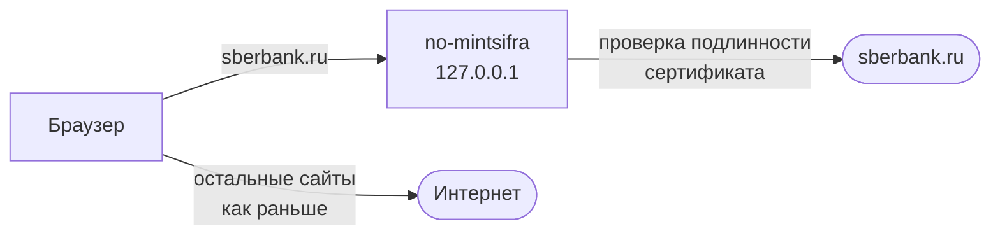

<div align="center">

# 🔐 no-mintsifra

**Сайты на сертификатах Минцифры открываются в любом браузере: Сбербанк, ВТБ, Т-Банк, Альфа-Банк, государственные сервисы и другие.**  
**Корневой сертификат Минцифры при этом не устанавливается ни в Windows, ни в браузеры. Если он уже установлен, no-mintsifra поможет его удалить.**

[](https://github.com/Nettrove/no-mintsifra/releases/latest)
[](#-поддержка)
[](LICENSE)

[English](README.en.md)

</div>

> [!CAUTION]
>
> ### Официальный источник
> Устанавливайте no-mintsifra только со [страницы релизов](https://github.com/Nettrove/no-mintsifra/releases) этого репозитория. Программа бесплатна, у проекта нет каналов, групп и платных версий.  
> Копии, распространяемые от имени no-mintsifra в других местах, следует считать **поддельными**.

> [!IMPORTANT]
> **Что появляется в системе после включения:**
> - сертификат **«no-mintsifra local CA»**. Он создаётся на вашем компьютере, действует только на нём и только для доменов из списка, то есть сайтов на сертификатах Минцифры;
> - локальный прокси на `127.0.0.1`, через который проходят **только** эти домены. Остальной трафик идёт так же, как и прежде: напрямую или через ваш VPN;
> - автозапуск, чтобы обход работал после перезагрузки.
>
> Всё перечисленное удаляется одним пунктом меню. **Корневой сертификат Минцифры не устанавливается.**

> [!WARNING]
>
> ### Антивирусы
> Связка «локальный прокси и собственный сертификат» устроена так же, как проверка HTTPS в самих антивирусах, поэтому эвристические модули могут на неё реагировать.  
> Программа не является вредоносной: исходный код открыт, сборка выполняется в [GitHub Actions](.github/workflows/release.yml), контрольные суммы опубликованы в каждом релизе.

## ⚙️ Установка

1. Загрузите архив `no-mintsifra-...-windows-amd64.zip` со [страницы последнего релиза](https://github.com/Nettrove/no-mintsifra/releases/latest).

2. Распакуйте его в любую папку.

3. Запустите **`no-mintsifra.exe`**. Откроется меню:
   - **`1` Включить обход**. Выполняется один раз и сохраняется после перезагрузки.  
     <ins>Windows спросит, доверять ли сертификату «no-mintsifra local CA». Ответьте **«Да»**.</ins>
   - **`2` Выключить и удалить**. Удаляет сертификат, прокси, автозапуск и папку программы.
   - **`3` Проверить**. Открывает каждый домен из списка и показывает результат.
   - **`4` Обновить список сайтов**.
   - **`5` Удалить сертификат Минцифры**. Находит сертификаты Минцифры, установленные ранее (например, по инструкции банка или Госуслуг), и удаляет их, в том числе из хранилища всего компьютера.

4. Пользуйтесь браузером как обычно. Если браузер был открыт во время включения, перезапустите его.

После включения no-mintsifra доступен в меню «Пуск», а удалить его можно также через «Параметры → Приложения».

<details>
<summary><b>Установка одной командой PowerShell</b></summary>

```powershell
irm https://raw.githubusercontent.com/Nettrove/no-mintsifra/main/install.ps1 | iex
```

Скрипт загружает последний релиз, сверяет контрольную сумму и подпись файла и включает обход.

</details>

## 🌐 Поддержка

| Сайт | | Сайт | |
|---|:---:|---|:---:|
| Сбербанк, СберБанк Онлайн | ✅ | Совкомбанк | ✅ |
| ВТБ, ВТБ Онлайн | ✅ | ПСБ | ✅ |
| Т-Банк | ✅ | Россельхозбанк | ✅ |
| Альфа-Банк, Альфа-Онлайн | ✅ | МКБ | ✅ |
| НСПК (Мир, СБП) | ✅ | [добавить сайт](#-добавление-сайта) | ➕ |

Также поддерживаются Росбанк, Уралсиб, Точка, РНКБ, Модульбанк, МТС Банк, Банк ДОМ.РФ, Экспобанк, УБРиР, Авангард, Банк «Санкт-Петербург», ТКБ, СОГАЗ, ВСК, Альфа Страхование, СПБ Биржа, Роснефть, Сургутнефтегаз, Росстат и Федеральное казначейство: всего 35 доменов и более 900 адресов. Полный список выводит команда `no-mintsifra sites`.

Список ежедневно обновляется ботом по [каталогу](catalog/sites.yaml). Сайты, перешедшие на обычные сертификаты, исключаются автоматически.

| Браузер | |
|---|:---:|
| Chrome, Edge, Brave, Яндекс Браузер, Opera, Vivaldi | ✅ |
| Firefox | ✅ |

Подходит любой браузер, который использует настройки прокси и хранилище сертификатов Windows. Firefox делает это по умолчанию (проверено на версии 157). Отдельные ярлыки, флаги запуска и профили не требуются.

## ℹ️ Принцип работы



1. **Прокси-скрипт Windows** направляет в no-mintsifra только домены из списка. Остальные запросы идут так же, как до установки: напрямую или через прокси VPN-клиента.
2. **no-mintsifra подключается к сайту самостоятельно** и проверяет его сертификат: цепочка должна вести к корневому сертификату Минцифры, встроенному в программу, а сам сертификат должен быть выдан именно этому сайту. Корневой сертификат используется **только в памяти программы** и **только для доменов из списка**.
3. **Браузеру отправляется сертификат локального CA.** Ограничение по доменам записано в самом сертификате, поэтому даже при краже ключа им нельзя подписать сайт за пределами списка.
4. Далее данные **передаются без изменений**: программа их не анализирует, не сохраняет и никуда не отправляет. К сайту она подключается с тем же TLS-отпечатком, что и ваш браузер, поэтому системы защиты от ботов не блокируют соединение. Обращения к этим доменам по HTTP автоматически переводятся на HTTPS.

| | Сертификат Минцифры в системе | no-mintsifra |
|---|:---:|:---:|
| Доверие Минцифре | **для любого сайта** | только для сайтов, которые сами используют её сертификаты |
| Возможна подмена Google, Apple, Microsoft, мессенджеров | да | **нет** |
| Область действия | все браузеры и приложения | только домены из списка |
| Удаление | вручную | пункт `2` в меню |

## 🎯 Что именно получает Минцифры

Корневой сертификат Минцифры встроен в программу и используется только в её памяти: им проверяются сертификаты сайтов из списка, и только они. Список доменов, для которых действует локальный CA, строится по строгим правилам:

- **домен целиком** (например, `sberbank.ru` со всеми поддоменами) попадает в охват, только если сертификат Минцифры стоит на самом домене или на `www`;
- **иначе только отдельные адреса**, на которых бот увидел сертификат Минцифры (например, `rosstat.gov.ru`, но не весь `gov.ru`);
- **общие домены** (`gov.ru`, `mail.ru`, `yandex.ru`, `vk.com`, `ok.ru`, хостинги и другие) никогда не попадают в охват целиком, только отдельными адресами;
- **почта, мессенджеры, магазины приложений и подобные сервисы** (Google, Apple, Microsoft, Telegram, WhatsApp, Signal, Proton, GitHub и другие) не попадают в охват ни при каком списке. Это зашито в программу и защищает даже при краже ключа, которым подписан список.

Если список изменился, пункт **`1`** выпускает новый сертификат и перед этим показывает, какие домены добавятся и какие уберутся. Расширить охват без вашего согласия нельзя. Текущий охват показывает проверка (пункт **`3`**) и команда `no-mintsifra sites`.

## 🚧 Что не покрывается

- **Программы вне браузера** с собственным хранилищем сертификатов (Java, Python, Node.js, многие банк-клиенты) или без поддержки системного прокси. Для них сайты из списка открываются так же, как без no-mintsifra.
- **Браузеры со своим хранилищем сертификатов**, которые не доверяют сертификатам Windows: например, Tor Browser или Firefox с отключённой настройкой `security.enterprise_roots.enabled` (по умолчанию она включена).
- **Другие системы:** Android, iOS, macOS и Linux не поддерживаются.
- **Сайты не из списка.** Если сайт на сертификате Минцифры не открывается, [сообщите о нём](#-добавление-сайта).

## 🤔 Почему прокси, а не кросс-подпись

Есть способ обойтись без прокси: выпустить на ключ корня Минцифры кросс-сертификат с ограничением по доменам. Тогда браузер доверяет цепочке Минцифры напрямую, но только для доменов из списка. У этого способа три слабых места:

- **Браузеры могут заблокировать сам ключ.** В 2019 году Chrome, Firefox и Safari внесли в чёрный список корневой сертификат, который власти Казахстана требовали установить для перехвата трафика. Блокировка действует по ключу, независимо от того, кто и как его подписал, поэтому кросс-сертификат перестал бы работать в тот же день. Через прокси браузер видит только ваш локальный CA, а цепочку Минцифры проверяет сама программа, и такая блокировка на неё не влияет.
- **Проверка целиком зависит от браузера.** В прокси-режиме программа сама сверяет имя сайта, цепочку и ключ сертификата со списком и записывает расхождения. С кросс-подписью этих проверок нет, остаются только ограничения внутри сертификата, а их соблюдение разными программами отличается.
- **Это и есть сертификат Минцифры на компьютере.** Кросс-сертификат несёт имя и ключ Минцифры и стоит в хранилище Windows, пусть и с ограничениями. no-mintsifra этого не делает.

Поэтому no-mintsifra работает только через прокси.

## 🛡 Безопасность

- **Трафик к сайтам из списка проходит через прокси в расшифрованном виде.** Это неотъемлемая часть такой схемы. Прокси работает только на вашем компьютере, ничего не сохраняет и не передаёт. Исходный код открыт: [`internal/proxy`](internal/proxy).
- **Ключ локального CA** хранится в `%LocalAppData%\no-mintsifra\ca`, зашифрован DPAPI для вашей учётной записи Windows и действителен только для доменов из списка.
- **Список сайтов подписан** ключом ed25519. Неподписанный или более старый список программа не принимает.
- **Бот проверяет сертификаты сайтов** по цепочке до корневого сертификата Минцифры и по имени сайта.
- **Подмена сертификата заметна.** Если сайт показывает сертификат, ключа которого нет в подписанном списке, прокси пропускает соединение, но записывает предупреждение. Оно видно в проверке (пункт **`3`**).
- **Журнал прокси** (`%LocalAppData%\no-mintsifra\proxy.log`) содержит только время, адрес и причину неудачных соединений. Содержимое трафика в него не попадает.

Подробнее: [модель угроз](docs/THREAT_MODEL.md) и [устройство программы](docs/ARCHITECTURE.md). Об уязвимостях сообщайте по инструкции в [SECURITY.md](SECURITY.md).

## ☑️ Частые вопросы

<details>
<summary><b>Сайт не открывается</b></summary>

1. Запустите no-mintsifra из меню «Пуск» и выберите **`3` Проверить**. Статус должен быть **ВКЛЮЧЁН**.
2. Если указано **РАБОТАЕТ НЕ ПОЛНОСТЬЮ**, рядом перечислено, чего не хватает. Пункт **`1`** восстанавливает установку.
3. Перезапустите браузер.
4. Если проблема сохраняется, создайте [Issue](https://github.com/Nettrove/no-mintsifra/issues/new?template=bug.yml) и приложите отчёт: команда `no-mintsifra doctor --report` сохранит его в «Документы».
</details>

<details>
<summary><b>Сертификат Минцифры уже установлен. Что делать?</b></summary>

Выберите в меню пункт **`5`**. no-mintsifra найдёт сертификаты Минцифры в хранилищах вашей учётной записи и всего компьютера, покажет их и удалит. Для хранилища компьютера Windows запросит права администратора. Пока такой сертификат установлен, меню показывает предупреждение.

Затем включите обход пунктом **`1`**: сайты на сертификатах Минцифры продолжат открываться, но без доверия Минцифре для всего интернета.

> [!WARNING]
> no-mintsifra работает только для браузеров. Программы вне браузера (1С, банк-клиенты, корпоративный софт) проверяют сертификаты по хранилищу Windows и после удаления могут перестать подключаться к этим сайтам.

Удаление необратимо. Если сертификаты понадобятся снова, их можно скачать на [gosuslugi.ru/crt](https://www.gosuslugi.ru/crt).
</details>

<details>
<summary><b>Windows спрашивает о сертификате «no-mintsifra local CA». Это безопасно?</b></summary>

Это ваш собственный сертификат. Он создаётся на вашем компьютере при включении и больше нигде не существует. В нём записан список доменов, и Windows и браузеры не примут его ни для какого другого сайта. Без него браузер не будет доверять ответам прокси.
</details>

<details>
<summary><b>Совместимость с VPN и другими прокси</b></summary>

no-mintsifra работает через прокси-скрипт Windows и учитывает прокси, который VPN-клиент (v2rayN, Clash, Hiddify и другие) прописывает в режиме «системный прокси»:

- **сайты из списка** идут через no-mintsifra напрямую, мимо VPN. VPN им не нужен, а через зарубежный адрес банки могут блокировать вход;
- **адреса из исключений** VPN-клиента (например, `*.ru` или локальная сеть) идут напрямую, как и раньше;
- **весь остальной трафик** идёт через прокси VPN-клиента. Если прокси VPN-клиента недоступен, соединение не устанавливается, а не уходит напрямую: так же ведёт себя Windows без no-mintsifra.

Программа читает настройки прокси при каждом запросе браузера, поэтому включать и выключать VPN-клиент можно в любой момент. Проверка (пункт **`3`**) показывает, куда сейчас уходит остальной трафик.

VPN в режиме TUN (виртуальный сетевой адаптер) прокси-скрипт не использует. В этом режиме весь трафик, в том числе соединения no-mintsifra с сайтами из списка, идёт по правилам самого VPN-клиента. Если банк не пускает с зарубежного адреса, добавьте его домены в прямые маршруты VPN-клиента.

Если в Windows уже был задан другой прокси-скрипт, программа предупредит об этом, заменит его на время работы и восстановит при выключении.
</details>

<details>
<summary><b>SmartScreen сообщает «Windows защитила ваш компьютер»</b></summary>

Файл не подписан платным сертификатом разработчика. Нажмите «Подробнее», затем «Выполнить в любом случае». При установке через PowerShell это предупреждение не появляется.
</details>

<details>
<summary><b>Как обновляются список сайтов и сама программа?</b></summary>

**Список сайтов** программа загружает сама примерно раз в 12 часов. Если для нового списка нужен другой сертификат no-mintsifra, появится одно уведомление: откройте no-mintsifra и выберите пункт **`1`**. Перед заменой сертификата программа покажет, какие домены добавятся и какие уберутся. Без вашего согласия охват не расширяется.

**Сертификат no-mintsifra** действует три года. За 60 дней до окончания программа предупредит об этом, а пункт **`1`** выпустит новый.

**Сама программа** не обновляется автоматически. Меню и проверка раз в сутки сверяются с последним релизом и сообщают, если вышла новая версия. Скачать и запустить её нужно самостоятельно. Это сделано намеренно: программа, которая управляет доверенным сертификатом, не должна заменять себя без вашего участия, даже если кто-то получит доступ к выпуску релизов.
</details>

<details>
<summary><b>GitHub недоступен. Как обновлять список?</b></summary>

Список загружается с нескольких зеркал, а в каждую сборку встроена актуальная копия. Собственное зеркало задаётся переменной окружения, подпись при этом проверяется:

```powershell
setx NO_MINTSIFRA_SOURCES "https://mirror.example/no-mintsifra/pins"
```

Зеркало должно отдавать все четыре файла из ветки [`pins`](../../tree/pins): `pins.v2.json` и `pins.v2.json.sig` для текущих версий, `pins.json` и `pins.json.sig` для старых версий. Если на зеркале только `pins.json`, текущие версии не получат с него список и будут использовать встроенную копию.
</details>

<details>
<summary><b>Почему не установить сертификат Минцифры?</b></summary>

Корневой сертификат позволяет его владельцу выпустить действительный сертификат для **любого** сайта: почты, мессенджера, облачного хранилища. Его установка означает доверие ко всему интернету ради нескольких сайтов. no-mintsifra доверяет Минцифре только там, где сайты сами используют её сертификаты.
</details>

## 💻 Командная строка

| Команда | Действие |
|---|---|
| `no-mintsifra` | меню |
| `no-mintsifra install [-y]` | включить обход |
| `no-mintsifra uninstall [-y]` | выключить и удалить из системы |
| `no-mintsifra doctor [--report]` | проверить установку и все домены; `--report` сохраняет отчёт |
| `no-mintsifra update` | обновить список сайтов |
| `no-mintsifra sites` | показать охваченные сайты |
| `no-mintsifra remove-ministry-ca [-y]` | найти и удалить сертификаты Минцифры из Windows |

### ➕ Добавление сайта

Создайте [Issue](https://github.com/Nettrove/no-mintsifra/issues) с адресом сайта, который показывает ошибку сертификата. Сайт будет добавлен в [каталог](catalog/sites.yaml), бот проверит его цепочку и подпишет обновлённый список.

### 🛠 Сборка из исходного кода

Требуется [Go](https://go.dev/dl/) версии, указанной в [`go.mod`](go.mod).

```powershell
go test ./...
go build -ldflags "-H=windowsgui" -o no-mintsifra.exe ./cmd/no-mintsifra
```

```
cmd/no-mintsifra     меню и команды
cmd/pinbot           бот, собирающий и подписывающий список (работает в CI)
internal/proxy       прокси на 127.0.0.1 и прокси-скрипт
internal/localca     локальный CA с ограничением по доменам
internal/russianca   проверка цепочки до корневого сертификата Минцифры
internal/rootstore   хранилище сертификатов Windows
internal/sysproxy    прокси-скрипт Windows
internal/autostart   автозапуск
internal/appentry    запись в «Параметры → Приложения»
internal/update      загрузка списка с зеркал и защита от отката
```

### 🔎 Проверка релиза

**Контрольная сумма.** Сравните SHA-256 архива с файлом `SHA256SUMS.txt` из того же релиза:

```powershell
Get-FileHash .\no-mintsifra-v1.0.0-beta-windows-amd64.zip -Algorithm SHA256
```

**Происхождение сборки.** Архивы релизов публичного репозитория сопровождаются аттестацией GitHub: она подтверждает, что архив собран в [GitHub Actions](.github/workflows/release.yml) из этого репозитория, а не на чьём-то компьютере. Проверка через [GitHub CLI](https://cli.github.com/):

```powershell
gh attestation verify .\no-mintsifra-v1.0.0-beta-windows-amd64.zip -R Nettrove/no-mintsifra
```

**Пересборка.** Сборка воспроизводима: из тех же исходников получается тот же файл. В описании каждого релиза указаны версия Go, коммит ветки `pins`, из которого взят встроенный список, и SHA-256 исполняемых файлов до подписи. Чтобы пересобрать, подставьте значения из описания релиза:

```bash
git clone https://github.com/Nettrove/no-mintsifra.git && cd no-mintsifra
git checkout v1.0.0-beta
git fetch origin pins
git show <коммит pins>:pins.v2.json > internal/snapshot/data/pins.json
git show <коммит pins>:pins.v2.json.sig > internal/snapshot/data/pins.json.sig
GOTOOLCHAIN=<версия Go> GOOS=windows GOARCH=amd64 go build -trimpath -buildvcs=true \
  -ldflags "-s -w -H=windowsgui -X main.version=v1.0.0-beta" -o no-mintsifra.exe ./cmd/no-mintsifra
sha256sum no-mintsifra.exe
```

Хеш должен совпасть с указанным в описании релиза для `amd64`. Если файлы в релизе подписаны, подпись меняет их содержимое, поэтому сравнивается хеш до подписи.

## 👥 Авторы

- **[@Nettrove](https://github.com/Nettrove)**: идея, архитектурные решения, проверка.
- **[Claude](https://claude.ai/code)** (Anthropic): реализация. Такие коммиты помечены соавторством.

Распространяется по лицензии [MIT](LICENSE).
