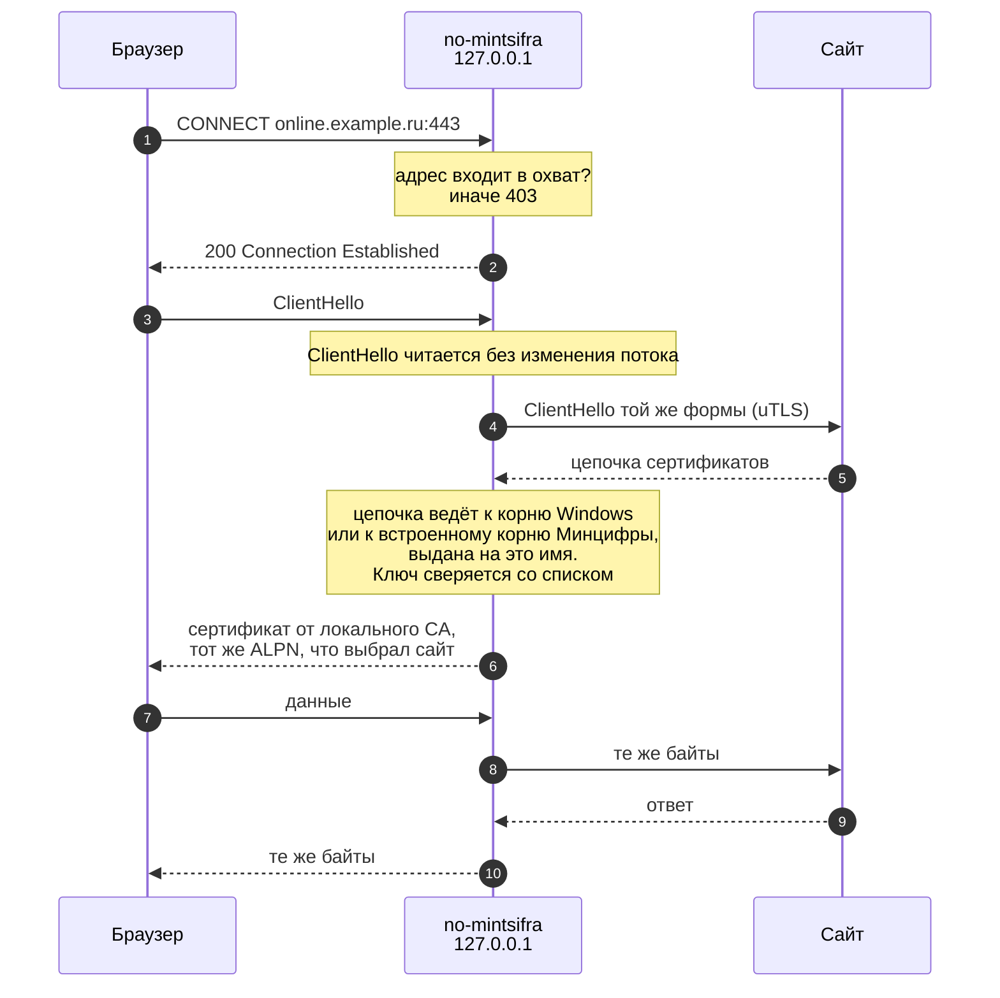
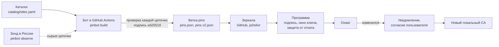

# Устройство программы

## Соединение

Браузер узнаёт из прокси-скрипта Windows, что домен из охвата нужно открывать через no-mintsifra на `127.0.0.1:47123`. Всё остальное идёт туда же, куда и до установки: напрямую или в прокси VPN-клиента.

- **Охват** задают ограничения по доменам в сертификате локального CA. Тот же список попадает в прокси-скрипт, поэтому браузер и прокси не расходятся.
- **Форма ClientHello** повторяет браузерную, чтобы фильтры ботов, сверяющие TLS-отпечаток с User-Agent, видели настоящий браузер. Если повторить не удалось, используется стандартная форма Chrome или Firefox, в зависимости от браузера.
- **Промежуточные сертификаты Минцифры** берутся из цепочки сайта, из программы и из подписанного списка. Каждый сертификат из списка сначала проверяется по встроенному корню.
- **Ошибки соединений** (адрес, этап, причина) пишутся в журнал без содержимого трафика.
- **Обычный HTTP** к доменам из охвата получает ответ 307 на HTTPS.

## Список сайтов

1. **Каталог** перечисляет сайты и их домены. Добавить сайт можно через issue.
2. **Бот** раз в сутки открывает каждый адрес, ищет поддомены у доменов на сертификатах Минцифры и оставляет только адреса, чья цепочка ведёт к корню Минцифры и выдана на это имя. Сертификаты, которым Windows и так доверяет, в список не попадают.
3. **Зонд** в России может дополнить наблюдения бота. Его данные проверяются так же, как собственные.
4. **Подписанный список** публикуется в ветке `pins` в двух форматах: `pins.json` для выпущенных версий и `pins.v2.json` с промежуточными сертификатами для новых.
5. **Программа** принимает только список с верной подписью, подписанный ключом в пределах его срока и не старше уже установленного. Копия списка встроена в каждую сборку.
6. **Охват** строится из списка по правилам из README. Если он изменился, программа сообщает об этом, а новый CA выпускается только после вашего согласия.

## Пакеты

| Пакет | Назначение |
|---|---|
| `cmd/no-mintsifra` | меню, команды, фоновый процесс `serve` |
| `cmd/pinbot` | бот: сканирование, наблюдения, подпись |
| `internal/proxy` | прокси, прокси-скрипт, журнал |
| `internal/localca` | локальный CA с ограничением по доменам |
| `internal/pins` | формат списка, охват, подпись |
| `internal/russianca` | проверка цепочек по встроенному корню Минцифры |
| `internal/probe` | чтение цепочек сертификатов сайтов |
| `internal/discover` | поиск поддоменов |
| `internal/update` | загрузка списка с зеркал |
| `internal/trust` | ключи подписи списка и сроки их действия |
| `internal/sysproxy` | прокси-скрипт и ручной прокси Windows |
| `internal/rootstore` | хранилища сертификатов Windows |
| `internal/autostart`, `internal/appentry`, `internal/winshell` | автозапуск, запись в «Приложения», окна и ярлыки |
