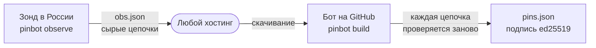

# Зонд из России

Бот, который собирает список сайтов, работает на серверах GitHub за пределами России. Часть сайтов на сертификатах Минцифры отвечает иностранным адресам иначе или не отвечает совсем. Зонд закрывает этот пробел: он запускается на любой машине в России и сообщает боту, какие сертификаты показывают сайты.

## Почему зонду не нужно доверять

Сертификат, выпущенный Минцифры для сайта, нельзя подделать: его подпись проверяется по корневому сертификату, встроенному в программу. Поэтому зонд передаёт только сырые цепочки сертификатов, без выводов, а бот проверяет каждую цепочку заново, как будто увидел её сам:

- цепочка должна вести к встроенному корневому сертификату Минцифры;
- сертификат должен быть выдан именно на этот адрес;
- сертификат должен действовать на момент проверки;
- адрес должен относиться к сайту из [каталога](../catalog/sites.yaml).

Утверждения зонда игнорируются. Даже полностью захваченный зонд может только не прислать данные или прислать бесполезные: добавить в список чужой сайт или поддельный сертификат он не в состоянии.

У зонда нет ключа подписи и нет прав на запись в этот репозиторий. Ключ подписи по-прежнему хранится только в окружении `pins` на GitHub.



## Настройка

Подойдёт самый дешёвый VPS в России или любой компьютер, который включён в нужное время.

1. Установите [Go](https://go.dev/dl/) и Git, затем загрузите исходный код:

   ```bash
   git clone https://github.com/Nettrove/no-mintsifra.git ~/no-mintsifra
   ```

2. Проверьте запуск вручную. Полный проход по каталогу занимает до 40 минут:

   ```bash
   cd ~/no-mintsifra && go run ./cmd/pinbot observe -catalog catalog/sites.yaml -out ~/obs.json
   ```

3. Выберите, где публиковать `obs.json`. Достаточно любого адреса, доступного по HTTPS: отдельный публичный репозиторий на GitHub (с deploy key, у которого есть права только на этот репозиторий), объектное хранилище или собственный веб-сервер.

4. Добавьте задание в cron. Бот запускается в 04:17 UTC, поэтому зонд должен закончить раньше:

   ```
   0 2 * * * cd ~/no-mintsifra && git pull -q && go run ./cmd/pinbot observe -catalog catalog/sites.yaml -out ~/obs.json && ~/publish-obs.sh
   ```

   где `publish-obs.sh` копирует `~/obs.json` в выбранное место.

5. Сообщите боту адрес файла:

   ```bash
   gh variable set PROBE_OBSERVATIONS_URL --repo Nettrove/no-mintsifra --body "https://example.org/obs.json"
   ```

Если адрес не задан, файл недоступен, повреждён или создан больше 48 часов назад, бот выводит предупреждение и собирает список только по своим данным. Ограничение по возрасту не даёт повтором старого файла удерживать в списке сайт, который уже ушёл с сертификата Минцифры.
